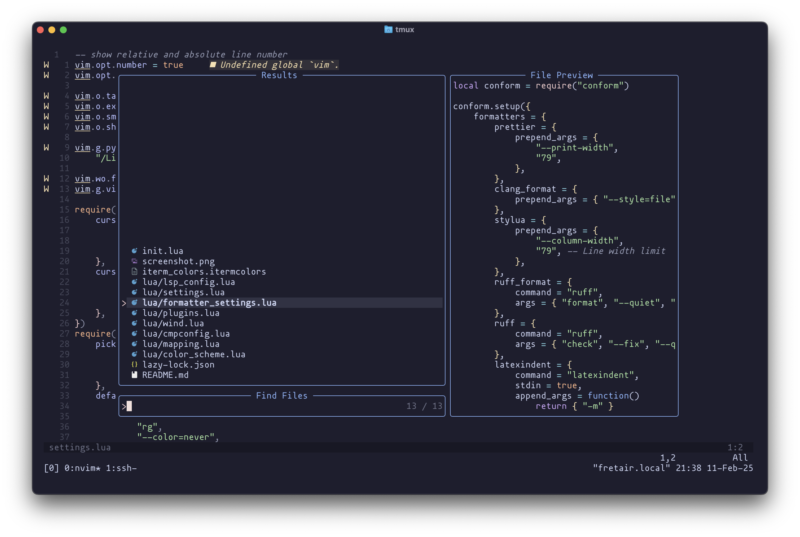

# neovim configuration



## requirement for mac os

- python3

```bash
brew install ripgrep
```

## setup

change the python path (`which python3`) in the `settings.lua` file

the theme automatically changes color theme to match the system


## how to install all the plugins?

in neovim invoke: `:Lazy`

## required lsp servers

install lsp servers/formatters with `:Mason` or `:MasonInstall <name>`

    ◍ buildifier
    ◍ clang-format
    ◍ clangd
    ◍ cmake-language-server cmake
    ◍ cmakelang
    ◍ codelldb
    ◍ gdtoolkit
    ◍ isort
    ◍ jdtls
    ◍ lua-language-server lua_ls
    ◍ marksman
    ◍ omnisharp
    ◍ prettier
    ◍ pyright
    ◍ ruff
    ◍ rust-analyzer rust_analyzer
    ◍ stylua

### Other

font: https://github.com/ryanoasis/nerd-fonts/releases/download/v3.2.1/BigBlueTerminal.zip

iterm colors in the repo
